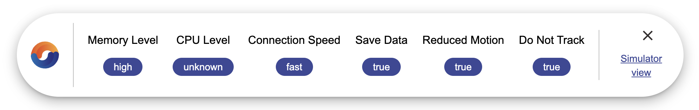

# @netcentric/ProgUX

<p align="center">
  <a href="https://www.npmjs.com/package/@netcentric/progux">
    
  </a>

  <a href="https://bundlephobia.com/result?p=@netcentric/progux">
    
   </a>
</p>

> The Progressive User Experience Library (ProgUX) lets you progressively enhance your website or PWA based on the following criteria:

- Users Preferences
  - Prefers Reduced Motion
  - Save Data Settings
  - Tracking Settings
- Device Capabilities
  - CPU Capacity
  - Memory Level
- Network
  - Connection Speed

The libraray is using modern browser APIs to collect the data of the current session and creates a JavaScript object in the Session Storage and CSS classes in the <body>. Each of these can be used to decide what features, content, web fonts, JavaScript, CSS, etc. will be delivered to the user to create a progressive user experience.

The idea is similar to [react-adapitve-hooks](https://github.com/GoogleChromeLabs/react-adaptive-hooks).
However ProgUX is not limited to React and provides a simulator which makes it easy to test different settings in the developer/test mode.

## Installation

To start using ProgUX inline the code from `dist/prod/bundle.js` before any other JavaScript and CSS code in the <head> and call the progUX() to initialise the script. If you want to override any of the configurations pass it to the function as an object.

```
<script type="application/javascript">
  !function(){"use strict";const n=n=>"connection"in navigator ... // inline whole code

  progUX({
      sessionStorageKey: 'someOtherKeyName'
  });
</script>
```

The web performance impact to run the production code is about ~10ms (measured on a local dev environment without throtteling).

## Usage

How your application changes and adapts to the environmental constraints and capabilities is ultimately up to you. ProgUX will not perform any magic that will change your application, it simply provides each developer who uses it a snapshot with which they can make decisions.

Ultimately how you use this is up-to-you, below we describe how you can gain access to this information.

Once installed and the application has reloaded developers will have access to an object in the session storage as well as a number of classes to reference in the `<HTML>` tag.

### Session Storage Object

The object will contain the following keys and values:

```javascript
connectionSpeed: String; // 'slow/fast/unknown'
cpuLevel: String; // 'low/mid/high/unknown'
memoryLevel: String; // 'low/mid/high/unknown'
reducedMotion: Boolean;
saveData: Boolean;
doNotTrack: Boolean;
```

### CSS Classes

The `<HTML>` tag will contain the following classes

```
connectionSpeed-[slow/fast/unknown]
cpuLevel-[low/mid/high/unknown]
memoryLevel-[low/mid/high/unknown]
reducedMotion-[true/false]
saveData-[true/false]
doNotTrack-[true/false]
```

The output will look similar to this

```
<html class="connectionSpeed-slow cpuLevel-low ...">
```

You then have access to the classes to make decisions in your code, for example

```
.connectionSpeed-slow {
  .stage-image {
    display: block;
  }

  .stage-video {
    display: none;
  }
}
```

_To try to limit the impact of unnecessary JavaScript checks ProgUX will only update the `connectionSpeed` during a user session. This is simply because we believe that this is the only one of our checks likely to change during a session._

### Development/testing Environment

To aid developers and testers we have provided a `dist/dev/dev-bundle.js` and `dist/dev/dev-bundle.css` files that contain extra features.

Using this script will run the checks in exactly the same way as the production script but contains a modal that allows you to change the settings on the fly.

You can inline this script as well or use it as modules (JS). CSS you can add to your project and link to the stylesheet in the head.

#### Settings Modal

Once your application has loaded you will see a cog icon (by default in the top left of your screen), if you click the icon it will open the settings modal.


The modal will automatically be set to reflect the current settings and to make adjustments to this you simply alter the controls to your new desired configuration and hit the 'Submit' button. This will force a page reload, the session storage object and the classes in the HTML will have been updated

Inside the modal there is also a toggle switch to show a 'Current Status' bar.



This is designed so that if you need to take screenshots of particular variations of the application it will be easy to identify the ProgUX settings at that time.

The Status Bar is moveable to provide you with the best result.

### Configuration

ProgUX provides a `config.js` file found in `src/js`.

Inside the file you will find an object with the following properties

```javascript
// prod and dev
settings: lowRAM: Number; // 0.25, 0.5, 1, 2, 4, 8
lowCPU: Number; // > 0
slowConnectionTypes: Array; // 'slow-2g','2g','3g', or '4g'
sessionStorageKey: String; // 'progressiveUserSettings',
// dev only
sessionStorageDevKey: String; // 'progressiveUserDevSettings',
defaultDevSettings: isDraggable: Boolean;
mode: String; // 'closed','open'
posTop: Number; // 20 (in px)
posLeft: Number; // 20 (in px)
```

You can use this attribute names and structure when overriding wanted attributes.

### Overriding config

Oveeride of the default congiguration is possible by passing the object with new values for wanted properties to init function (progUX() or progUXdev())

Overriding the values will set the thresholds tested by ProgUX in your application.
For instance, by default `slowConnectionTypes` is set to `['slow-2g', '2g', '3g']`, if you considered '3g' to not be a slow connection you could remove it.

Overriding the sessionStorageKey will alter the name of the object saved in your session storage, etc.

## Browser Support

Unfortunately, not all modern browsers support all the APIs, so please check support list before using and plan fallback.

- [Network Information API - saveData](https://developer.mozilla.org/en-US/docs/Web/API/Network_Information_API) is available in [Chrome 61+, Opera 48+, Edge 79+, Chrome for Android 76+, Firefox for Android 68+](https://caniuse.com/#search=saveData)

- [Navigator API - doNotTrack](https://developer.mozilla.org/en-US/docs/Web/API/Navigator/doNotTrack) is available in [Chrome 23+, Firefox 32+, Opera 12.1+, Edge 17+, Chrome for Android 76+, Firefox for Android 68+](https://caniuse.com/?search=navigator.doNotTrack)

- [Prefers Reduced Motion Media Query](https://developer.mozilla.org/en-US/docs/Web/CSS/@media/prefers-reduced-motion) is available in [Chrome 74+, Firefox 63+, Safari 10.1+ Opera 12.1+, Edge 79+, Chrome for Android 76+, Firefox for Android 68+, iOS Safari 10.3+](https://caniuse.com/?search=prefers-reduced-motion)

- [Network Information API - effectiveType](https://developer.mozilla.org/en-US/docs/Web/API/NetworkInformation/effectiveType) is available in [Chrome 61+, Opera 48+, Edge 79+, Chrome for Android 76+, Firefox for Android 68+](https://caniuse.com/#search=effectiveType)

- [Hardware Concurrency API](https://developer.mozilla.org/en-US/docs/Web/API/NavigatorConcurrentHardware/hardwareConcurrency) is available in [Chrome 37+, Safari 10.1+, Firefox 48+, Opera 24+, Edge 15+, Chrome for Android 76+, Safari on iOS 10.3+, Firefox for Android 68+, Opera for Android 46+](https://caniuse.com/#search=navigator.hardwareConcurrency)

- [Device Memory API](https://developer.mozilla.org/en-US/docs/Web/API/Navigator/deviceMemory) is available in [Chrome 63+, Opera 50+, Edge 79+, Chrome for Android 76+, Opera for Android 46+](https://caniuse.com/#search=deviceMemory)

## Contributing

Pull requests are welcome. For major changes, please open an issue first to discuss what you would like to change.

## License

[MIT](https://choosealicense.com/licenses/mit/)
